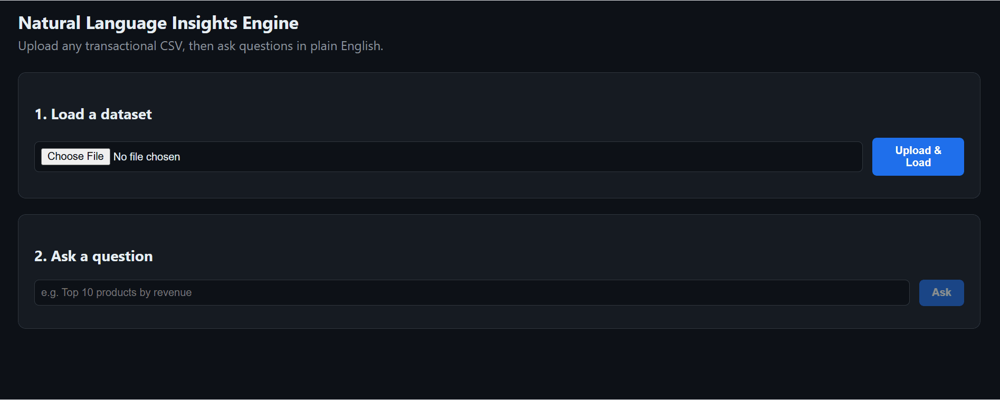
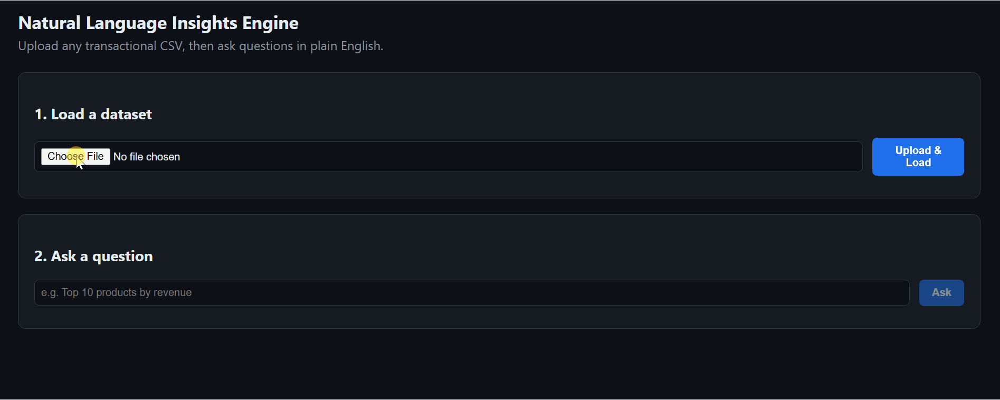

# Natural Language Insights Engine

Ask plain-English questions of any transactional CSV and get an accurate,
guarded answer — no code changes required for a new file's schema.

See [`docs/SYSTEM_DESIGN.md`](docs/SYSTEM_DESIGN.md) for architecture,
the path a question takes, and the biggest design decisions.

## Quickstart (local, no Docker)

Requires Python 3.11+ and, for the local LLM, [Ollama](https://ollama.com).

```bash
git clone <this-repo>
cd nlq-engine
./scripts/setup.sh
```

This creates a virtualenv, installs dependencies, pulls the default local
model (`qwen2.5-coder:7b-instruct`) if Ollama is installed, and starts the
API at **http://localhost:8000** — open that URL for the UI.

If you'd rather do it by hand:

```bash
python3 -m venv .venv && source .venv/bin/activate
pip install -r requirements.txt
cp .env.example .env
ollama pull qwen2.5-coder:7b-instruct   # one-time, ~4.7GB
uvicorn app.main:app --reload --port 8000
```

## Quickstart (Docker)

```bash
docker compose up --build -d
docker compose exec ollama ollama pull qwen2.5-coder:7b-instruct
```

Then open http://localhost:8000. The model pull is a separate step so
the image build itself doesn't have to download multi-GB weights.

## Which local LLM to use

The app talks to Ollama over its HTTP API and asks for **strict JSON
output**, so the model needs to be reasonably good at (a) SQL and (b)
following an output-format instruction, on hardware a laptop can run.

**Default / recommended: `qwen2.5-coder:7b-instruct`**
Strong at reading a schema and writing correct SQL, reliably returns
well-formed JSON when asked, and runs comfortably on 16GB RAM (8GB with
a 4-bit quant) with no GPU required. This is what `.env.example` and
`docker-compose.yml` are pre-configured for.

Alternatives, if you want to try something else:

| Model | Why you'd pick it | Tradeoff |
|---|---|---|
| `qwen2.5-coder:7b-instruct` *(default)* | Best balance of SQL accuracy, JSON-following, and speed on consumer hardware | — |
| `llama3.1:8b-instruct` | Slightly better general reasoning for ambiguous/refusal cases ("is this even answerable?") | A bit weaker at gnarly SQL (window functions, self-joins) than the coder-tuned model |
| `sqlcoder:7b` ([defog](https://ollama.com/library/sqlcoder)) | Purpose fine-tuned for text-to-SQL, very strong raw SQL accuracy | Not instruction-tuned for the JSON-envelope + refusal-reasoning format this app relies on; would need a thin adapter layer |
| `qwen2.5-coder:14b` / `32b` | Noticeably better on harder multi-table-style questions if you have the RAM/VRAM | Slower per query; overkill for the take-home's question set |

Swap models by changing `OLLAMA_MODEL` in `.env` (no code changes) and
running `ollama pull <model>`. To use a hosted model instead of a local
one, set `LLM_PROVIDER=openai_compatible` and fill in `OPENAI_BASE_URL` /
`OPENAI_API_KEY` / `OPENAI_MODEL` — same code path, see `app/llm_client.py`.

## Using it

1. Open http://localhost:8000, upload a CSV (try `data/sample_retail.csv`,
   a small stand-in for the UCI Online Retail shape, or
   `data/sample_orders_different_schema.csv`, which uses completely
   different column names to prove the schema inference isn't hardcoded).
2. Once ingestion finishes you'll see the inferred schema and a
   `dataset_id`.
3. Ask a question, e.g.:
   - "Top 10 products by revenue"
   - "Which countries grew most between two quarters"
   - "Net revenue in March 2024"
   - "How many customers bought only once, and what share of revenue do they represent"
   - "Which products are most often bought together"
   - Something out of scope for the data (e.g. "average customer age") —
     the app should refuse rather than invent an answer.

### Or via the API directly

```bash
# 1. Ingest — returns a job id immediately
curl -s -F "file=@data/sample_retail.csv" http://localhost:8000/ingest
# => {"job_id": "...", "poll_url": "/jobs/...", "stream_url": "/jobs/.../stream"}

# 2. Poll until done
curl -s http://localhost:8000/jobs/<job_id>

# 3. Ask a question against the resulting dataset_id
curl -s -X POST http://localhost:8000/query \
  -H "Content-Type: application/json" \
  -d '{"dataset_id": "<dataset_id>", "question": "Top 10 products by revenue"}'
# => {"job_id": "...", ...}  -- poll /jobs/<job_id> again for the result
```

Interactive API docs: http://localhost:8000/docs

## Tests

```bash
pytest -v
```

Unit tests cover the SQL guardrails and schema inference directly; API
tests run the ingest→query flow end to end against a fake LLM client (so
CI doesn't need a live model). Runs on every push via
`.github/workflows/ci.yml`.

## Evaluation / guardrail harness

```bash
uvicorn app.main:app &          # server must be running
python eval/run_eval.py         # needs a live LLM (Ollama or OpenAI-compatible)
```

Checks a mix of answerable questions, exact-count questions (verified
against ground truth), and intentionally out-of-scope questions that
should be refused. See `eval/README.md`.

## Configuration

All config lives in `.env` (see `.env.example`): LLM provider/model,
storage directories, upload size cap, query timeout, result row cap,
job worker pool size.

## Out of scope (per the assignment)

Cloud deployment, authentication, visual polish.

## What I'd build next

See the end of `docs/SYSTEM_DESIGN.md`.

## Demo

### Loading an unseen CSV


### Querying the data
