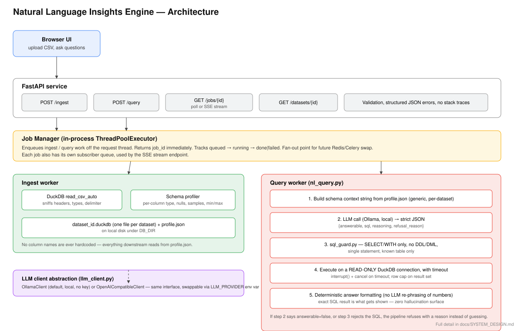

# System Design — Natural Language Insights Engine

## 1. Components and what each owns

| Component | File(s) | Owns |
|---|---|---|
| **FastAPI service** | `app/main.py`, `app/routes/*` | HTTP surface: validation, status codes, structured JSON errors, routing. Never touches SQL or the LLM directly. |
| **Job Manager** | `app/jobs.py` | Turning a slow operation into `job_id → poll/stream`. Owns job lifecycle (`queued → running → done/failed`) and in-memory state. |
| **DuckDB layer** | `app/db.py` | Everything about turning a CSV into a queryable table and a schema *profile* (types, nulls, cardinality, samples, ranges). Owns the one `.duckdb` file per dataset and its `profile.json`. |
| **LLM client** | `app/llm_client.py` | Talking to a model (Ollama locally, or any OpenAI-compatible endpoint) and returning parsed JSON. Owns provider-specific request/response shape and error translation — nothing above it knows which provider is in use. |
| **NL→SQL pipeline** | `app/nl_query.py` | The actual "insight" logic: builds the prompt from a dataset profile, calls the LLM, and turns its answer into a `QueryResult`. Owns the system prompt and the deterministic answer formatter. |
| **SQL guard** | `app/sql_guard.py` | The one place that decides whether a piece of generated SQL is allowed to run. Pure function, fully unit-testable, no I/O. |
| **Frontend** | `frontend/index.html` | A single-page vanilla-JS UI: upload, poll, render schema + answers. No build step, because a build pipeline wasn't worth the setup-time budget here. |

## 2. The path a question takes, input to answer

1. Browser `POST /query {dataset_id, question}` → FastAPI validates the body, loads that dataset's `profile.json`, and hands the work to the Job Manager. Returns `202 {job_id}` immediately — the caller is never blocked on LLM latency.
2. A worker thread runs `nl_query.answer_question`:
   a. `build_schema_context()` turns the *stored profile* (not the raw CSV) into a compact text block: column names, DuckDB types, null/distinct counts, min/max, and a handful of real sample values.
   b. That context + the question go to the LLM with a system prompt that demands strict JSON: `{answerable, sql, reasoning, refusal_reason}`.
   c. If `answerable` is false, the pipeline stops and returns the model's `refusal_reason` — no SQL is ever run.
   d. If SQL is returned, `sql_guard.validate_sql()` checks it: single statement, starts with `SELECT`/`WITH`, no DDL/DML keyword, only references the one known table. Any failure here also becomes a refusal, not an attempt to "fix" the query.
   e. The validated SQL runs on a **read-only** DuckDB connection, in a thread with a timeout; on timeout the connection is interrupted and the query reported as failed rather than left running.
   f. Results are capped at `MAX_RESULT_ROWS` and formatted deterministically — the natural-language "answer" string is built from the actual rows returned, never re-generated by the LLM, so the numbers shown are exactly what the SQL engine computed.
3. The Job Manager marks the job `done` with that result attached (or `failed` with a message, never a stack trace).
4. Browser polls `GET /jobs/{id}` (or subscribes to `GET /jobs/{id}/stream`, SSE) until it sees `done`/`failed`, then renders `answer`, `sql`, and the row table, or the refusal reason.

## 3. How schema context is built from an unfamiliar file — and where that breaks

On ingest, `read_csv_auto(..., sample_size=-1)` scans the *entire* file (not a prefix) to sniff delimiter, header, and per-column types, then `DESCRIBE` gives us DuckDB's own type inference. From there we compute null count, distinct count, up to 5 real sample values, and min/max for orderable types — all generically, keyed only on whatever column names actually appear in that file. This profile, not the CSV, is what the LLM ever sees; nothing about "UCI Online Retail" or any other dataset's shape is referenced anywhere in the prompt or code.

Where this breaks:
- **Semantic columns the LLM has to guess at.** If a file has `qty` and `unit_cost` instead of `Quantity`/`UnitPrice`, the model has to infer that their product is "revenue-like" from names and sample values alone. It usually gets this right for common patterns (`price`, `amount`, `qty`, `cost`) but a truly obscure naming scheme (`col_7`, `x1`) will produce a lower-quality or refused answer — correctly, since guessing would be worse.
- **Composite/free-text keys.** "Products bought together" needs a shared order/basket identifier. If the CSV has no such column (e.g., one row per line item with no order id), the question becomes genuinely unanswerable, and the model should refuse — this is intentional, not a bug.
- **Type sniffing on messy real-world data.** A column that's 95% numeric and 5% "N/A" strings gets sniffed as VARCHAR, not DOUBLE, which changes what SQL the model needs to write (casts, `TRY_CAST`). We rely on the model seeing the actual `duckdb_type` and sample values to adapt, rather than assuming clean typed columns.
- **Very wide files.** The profile grows linearly with column count; at some point (very wide tables) the schema-context prompt could approach context-window limits. Not an issue for typical transactional exports, but worth flagging as a scaling limit rather than a solved problem.

## 4. Biggest decisions and the alternatives rejected

1. **DuckDB, not a "real" database, for the query engine.**
   Rejected: loading into Postgres/SQLite with a manual schema step. DuckDB's `read_csv_auto` gives free, strong type inference on arbitrary CSVs and runs in-process with no server to stand up — directly serving the "any CSV, no code changes" requirement. Tradeoff: DuckDB's role-based read-only guarantees are weaker than Postgres's; we compensate with the `sql_guard` static check *and* a read-only connection handle as a second, independent layer.

2. **Guardrails as a static allow-list + read-only connection, not a semantic layer or a second "judge" LLM call.**
   Rejected: asking a second LLM call to grade the first one's SQL for safety. That's slower, non-deterministic, and still trusts a model to catch what a five-line regex-based check catches deterministically. The one place we do trust the model's judgment is *answerability* (does the schema support this question at all), because that's a genuinely semantic call a static checker can't make.

3. **In-memory job store + `ThreadPoolExecutor`, not Redis/Celery, for async jobs.**
   Given the take-home's time box, a full queue/broker was over-engineering for a single-process demo. This was a conscious scope cut: it satisfies "submit, get an id, poll/stream, retrieve" correctly for one process, but doesn't survive a restart and doesn't fan out across worker processes. See §5 for what replaces it first.

4. **Deterministic answer formatting instead of a second LLM call to "phrase" the result.**
   Rejected: asking the LLM to write the final sentence from the row data. That reintroduces exactly the hallucination risk the guardrails were built to avoid — a model paraphrasing real numbers can silently change them. The formatter in `nl_query.py` builds the answer string directly from the SQL result, so what's displayed is provably what was computed.

5. **Local LLM via Ollama as the default provider, with a swappable OpenAI-compatible client.**
   Rejected: hardcoding a single hosted API. Local-first keeps the "clone and run in 15 minutes on a clean machine" requirement honest (no API key to provision) and keeps cost at zero for repeated evaluation runs, while the `LLMClient` interface means swapping to a stronger hosted model is a one-line config change, not a refactor.

## 5. What I'd build next, in order

1. **Redis + RQ (or Celery) for job execution**, replacing the in-process thread pool — survives restarts, allows multiple worker processes, and is the direct fix for "what happens under concurrent load" (right now, load is bounded by `MAX_JOB_WORKERS` threads in one process; a burst of ingests queues behind that, which is safe but not horizontally scalable).
2. **A real SQL parser (e.g. sqlglot) in `sql_guard`** instead of regex-based table detection, closing edge cases like subqueries or CTEs referencing table names in comments/strings that a regex could misjudge.
3. **Follow-up questions / conversational context** — carry the last question+SQL into the next prompt so "now break that down by month" doesn't require restating the whole request.
4. **A semantic/metrics layer** — let users (or an admin) pin down what "revenue" means for a given dataset once, instead of asking the model to re-infer it every question.
5. **LLM observability** — log every (schema context, question, generated SQL, guard result, execution outcome) tuple so refusals and wrong answers are debuggable, and so the eval set in `eval/questions.json` can grow from production traffic instead of being hand-written.
